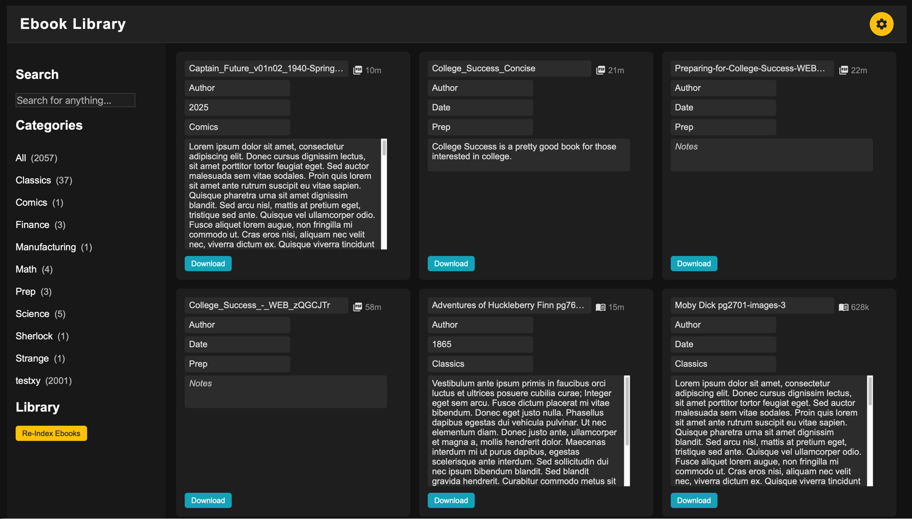

# Ebook Library

A modern, responsive web app for managing your personal ebook collection.  
Built with Flask and SQLite, this project lets you organize, search, and edit ebook metadata in a user-friendly interface.



## Features

- **Responsive card layout:** Works great on desktop and mobile.
- **Editable metadata:** Update title, author, date, category, and notes directly in the browser.
- **Instant search/filter:** Find ebooks by any field, including category and notes.
- **Save feedback:** Visual confirmation when metadata is updated.
- **Download links:** Download ebooks directly from the interface.
- **Re-indexing:** Scan your library folder for new or changed files.
- **Track Authors:** Manage authors and other search criteria.
- **Comments/notes:** Allow users to add personal notes or reviews.
- **Dark and light themes:** Easily switch between color schemes.
- **File Based:** Current Folder determines initial category

### Warning
Renames filename on disk to append a unique metadata tracker. That's right, don't point this to an existing file system that is being used by another ebook manager. This will rename the files by appending a unique tag which will break your other system. 

## Getting Started

### Run Locally

1. **Clone the repository:**
   ```sh
   git clone https://github.com/yourusername/ebook_library.git
   cd ebook_library
   ```

2. **Install dependencies:**
   ```sh
   pip install -r requirements.txt
   ```

3. **Run the app:**
   ```sh
   python app.py
   ```
   The app will start on `http://localhost:5100`.

4. **Add your ebooks:**
   - Place your `.pdf` or `.epub` files in the `ebooks/` folder.
   - Use subfolders to organize by category.

### Run with Docker

1. **Build the Docker image:**
   ```sh
   docker build -t ebook-library .
   ```

2. **Run the container:**
   ```sh
   docker run -d -p 5100:5100 -v $(pwd)/ebooks:/app/ebooks --name ebook-library ebook-library
   ```
   - The app will be available at `http://localhost:5100`.
   - Your local `ebooks` folder will be used inside the container.

### Run with Docker Compose

1. **Create a `docker-compose.yml` file in your project directory:**

    ```yaml
    version: '3'
    services:
      ebook-library:
        build: .
        ports:
          - "5100:5100"
        volumes:
          - ./ebooks:/app/ebooks
        restart: unless-stopped
    ```

2. **Build and start the app:**
    ```sh
    docker-compose up --build
    ```

3. **Access the app:**
    - Open [http://localhost:5100](http://localhost:5100) in your browser.

Your local `ebooks` folder will be available inside the container, and changes will persist.

## Folder Structure

```
ebook_library/
├── app.py
├── MetadataDB.py
├── LibraryScanner.py
├── templates/
│   └── index.html
├── static/
│   ├── styles.css
│   └── main.js
├── ebooks/
│   └── ...your ebook files...
└── README.md
```

## Contributing

Pull requests and suggestions are welcome!  
If you have ideas for new features or improvements, feel free to open an issue or submit a PR.

## License

MIT License

---

**Enjoy organizing your ebook library!**